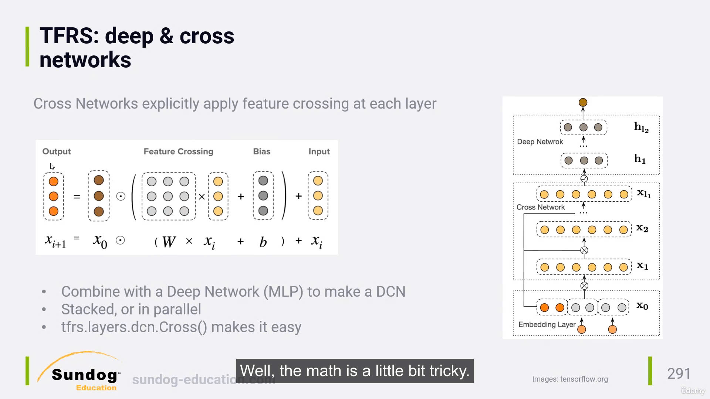

School project - Recommender System

Data: https://drive.google.com/drive/folders/1dXl3mYd7Xovkwa9hP3ivJMqdu2kf5Cln?usp=sharing

- category: 1M records
- ratings: 200K records

# Research terms

## Deep Learning

### TSRS (Tensor FLow Recommend System)

Đây là một thư viện của google được build để implement recommend system dễ dàng bằng TensorFlow + Keras

Đọc doc ở đây: https://www.tensorflow.org/recommenders/examples/quickstart

Cơ chế hoạt động:

Gồm 2 stage chính:

- Retrival stage: stage này sẽ thực hiện tương tự build ra embedding layer của user và movie (trong bài toán movie lens). Dựa vào đó và map chúng vào các vector đa chiều để tính toán độ tương đồng giữa các user và giữa các movie
  => Kết quả của stage này là sẽ cho ra một list các candidate item (gọi là các recommend item tiềm năng) dựa vào độ tương đồng để dự đoán là một user nào đó đã xem qua movie này chưa. (theo mình hiểu là vậy?)

- Ranking stage: stage này sẽ thực hiện lấy input là các candidate items từ Retrival stage phía trên để đưa vào một model deep lerning nhiều lớp để train => và dự đóan rating của từng cặp user - movie tương ứng (đến bước này ta mới sử dụng dữ kiện của rating score, còn retrieval stage không hề đụng đến mà chỉ sử dụng các đặc điểm của movie và user để tính độ tương đồng)

#### Các concept khác của TSRS

- Side features and Deep Retrieval: cái này hiểu đơn giản là thay vì chỉ lấy các đặc trưng cơ bản của movie như là title, description ta sẽ lấy nhiều đặc trưng hơn để bỏ vào retrival stage: như timestamp,... => điều này giúp sử lý vấn đề thiếu hụt dữ liệu, cold start problem....

- Multi task recommendation: trong các web ecomerce thì ta có thể kết hợp nhiều loại behaviour của user lại để recommend, mà với mỗi loại như vậy ta cần dùng các model chuyên biệt,.. việc này làm phức tạp hóa vấn đề mà ta có thể dùng "joint model" mà TSRF giới thiệu để kết hợp tất cả các dạng recommend này lại với nhau: https://www.tensorflow.org/recommenders/examples/multitask

- Deep and cross Network:
  

Cái này hiểu đơn giản là ví dụ: một user A nào đó mua táo, và sách dạy nấu ăn => ta recommend cho họ một cái máy ép táo (vì có thể đoán họ mua táo về để chế biến, mà chế biến thường cần máy ép) => cách recommend này có thể được recommend bằng cách áp dụng Cross Network

Có thể dễ dàng implement bằng TSRF: https://www.tensorflow.org/recommenders/examples/dcn

- ANN: đây là một thuật toán để optimize thời gian xuất input của retrieval stage, đọc [ANN Paper](HelpfulPapers/ann.pdf) để biết thêm chi tiết

### DeepFM

Ý tưởng đơn giản của DeepFm là nó combine 2 method: Matrix Factorizaion và Deep learning để xây dựng recommender system.

- Deep Learning mạnh về recommend high order feature
- Matrix factorization mạnh về recommend low order feature

Vậy high order và low order feature là gì?

- Low-order features: Là những đặc trưng đơn giản, trực tiếp và thường xuất hiện trong dữ liệu. Chúng là mối quan hệ giữa các thuộc tính cơ bản mà không cần qua xử lý phức tạp.
  Ví dụ:
  - Tuổi của người dùng.
  - Giá của sản phẩm.
  - Số lần một sản phẩm được mua.

* High-order features: Là các đặc trưng phức tạp hơn, được sinh ra từ việc kết hợp hoặc tương tác giữa nhiều đặc trưng low-order. Những đặc trưng này thường được học thông qua các mô hình học sâu (Deep Learning) để tìm ra mối quan hệ tiềm ẩn mà con người khó thấy được.
  Ví dụ:
  - Mối quan hệ giữa sở thích của người dùng và danh mục sản phẩm.
  - Xu hướng người dùng mua sản phẩm giảm giá vào cuối tháng.
  - Mối tương quan giữa độ tuổi và loại sản phẩm người dùng hay mua.

Cụ thể thì:

Low-order features:

- Người dùng A thích xem sản phẩm thuộc danh mục "Điện thoại".
- Sản phẩm X có giá 10 triệu VND.

High-order features (tương tác phức tạp giữa các đặc trưng):

- Người dùng A có xu hướng mua sản phẩm "Điện thoại giá tầm 10-15 triệu" khi có khuyến mãi lớn.
- Người dùng A thường mua điện thoại của hãng Y sau khi đã xem các bài đánh giá trên mạng xã hội.

Chi tiết xem paper sau: [Deepfm paper](HelpfulPapers/deepfm.pdf)
